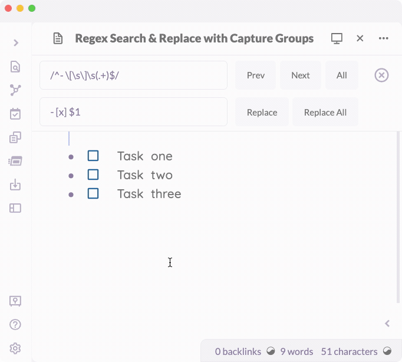

## Obsidian Regex Search & Replace

This plugin enhances the default Obsidian document search & replace functionality to include basic Regex queries

### Warning!

- This plugin is in an early testing phase. **Please backup any documents before attempting to do a regex search & replace**. 

### Features

- Regex functionality added to the default Obsidian search
- Regex also works with Search & Replace
- Capture groups are now supported for replacement
  - Use dollar sign references to refer to capture groups: $1 $2 etc
- Support for case-insensitive mode using /foo/i

### Instructions

- If you want to search using RegEx, enter your search into the default search box and use the standard regex syntax: `/[Ff]oo/`

### Not currently supported

- Advanced RegEx Mode modifiers
- Regex searching in preview mode
- Mobile usage

### Manually installing the plugin

- Copy over `main.js`, `styles.css`, `manifest.json` to your vault `VaultFolder/.obsidian/plugins/obsidian-regex-search-replace/`.

### Acknowledgment

- Big thanks to @pjeby for creating https://github.com/pjeby/monkey-around and helping write 80% of this code :)