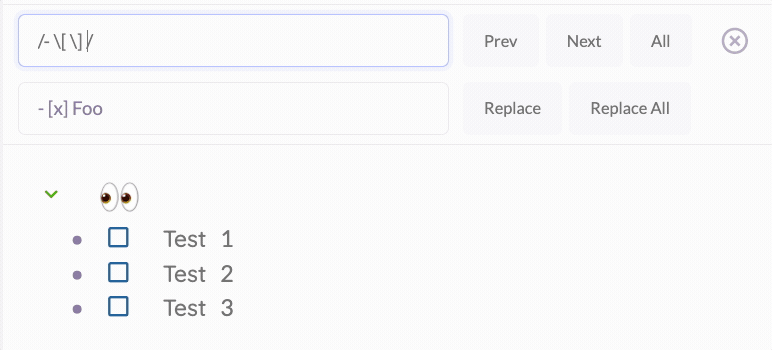

## Obsidian RegEx Search

This plugin enhances the default Obsidian document search to include basic RegEx functionality

### Features

- Basic RegEx functionality added to the default Obsidian search
- RegEx also works with Search & Replace
- Support for case-insensitive mode using /foo/i

### Instructions

- If you want to search using RegEx, enter your search into the default search box and use the standard regex syntax: `/[Ff]oo/`

### Not currently supported

- Replacing text using capture groups
- Advanced RegEx Mode modifiers

### Manually installing the plugin

- Copy over `main.js`, `styles.css`, `manifest.json` to your vault `VaultFolder/.obsidian/plugins/obsidian-regex-search/`.

